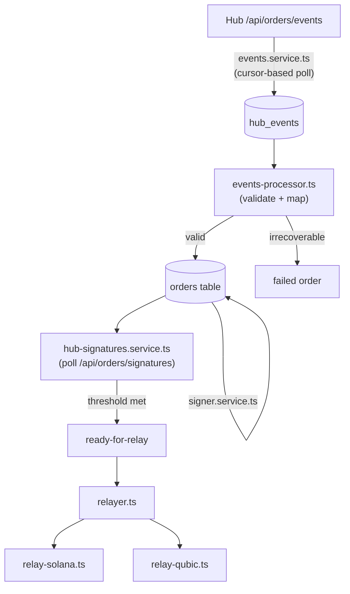

# Oracle – Agent Notes

## Overview
TypeScript Fastify service that participates in the replicated oracle network for the Qubic ↔ Solana bridge. Multiple oracle instances run in parallel; each independently validates on-chain events, signs orders, reports consensus to the Hub, and relays ready orders on-chain.

Responsibilities:
- Authenticate inbound Hub requests via `X-Hub-*` signed headers.
- Poll the Hub for new chain events and for aggregated order signatures.
- Validate and process events into orders; sign valid orders.
- Relay orders on-chain with exponential backoff once the signature threshold is reached.

Entry point `src/server.ts` registers `src/app.ts`, which autoloads infra plugins, then app plugins, then routes.

## Runtime Architecture

### Infra plugins (`src/plugins/infra`)
- `env.ts` — validates config (`EnvConfig`); sanitizes key file paths.
- `@file-manager.ts` — enforces JSON-only file extension and blocks path traversal on all key file loads.
- `@knex.ts` — SQLite setup (`better-sqlite3`) and auto-table creation.
- `poller.ts` — single/fallback HTTP poller with timeout and jitter.
- `undici-client.ts` — pooled HTTP JSON clients for Hub polling.
- `helmet`, `cors`, `rate-limit`, `sensible` — baseline security / DX.

### App plugins (`src/plugins/app`)
- **Hub auth**: `hub-keys.ts` loads the Hub's public keys; `hub-verifier.ts` registers a `preValidation` hook on all `/api/*` routes that validates and verifies `X-Hub-*` headers (see **Hub → Oracle Authentication** below); `hub-nonces.repository.ts` stores used nonces; `hub-nonces-cleaner.ts` evicts expired nonces.
- **Orders**: `indexer/orders.repository.ts` — CRUD over the oracle's local SQLite order table.
- **Events pipeline**:
  1. `events.service.ts` — polls Hub `/api/orders/events` using per-Hub cursors stored in `hub_event_cursors`; appends new events to `hub_events`.
  2. `events-processor.ts` — validates and maps pending events into order records; retries up to `EVENT_MAX_RETRIES`; creates failed orders for irrecoverable `outbound`/`lock` events. Chain-specific validators live under `events/solana/` and `events/qubic/`.
- **Signer**: `signer.service.ts` — loads Solana + Qubic keys from files and signs bridge orders; `schemas/keys.ts` validates key file structure.
- **Hub signatures**: `hub-signatures.service.ts` — polls Hub `/api/orders/signatures`, stores new signatures in `order_signatures`, marks orders `ready-for-relay` once `ORACLE_SIGNATURE_THRESHOLD` is met.
- **Relayer**: `relayer.ts` — processes `ready-for-relay` orders via `relay-solana.ts` / `relay-qubic.ts` with exponential backoff and per-order retry tracking; `relayer-fee-acceptance.ts` enforces minimum relayer fee floors before accepting relay.
- **Common utilities** (`src/plugins/app/common/`): `bytes.ts`, `decimals.ts`, `order-id.ts`, `protocol.ts` — shared primitive helpers; `qubic/encoding.ts`, `qubic/order-struct.ts`, `qubic/qsb-message.ts` — Qubic binary codec; `solana/errors.ts`, `solana/program.ts` — Solana RPC error handling; `schemas/common.ts` — shared TypeBox fragments; `validation.ts` — TypeBox `ValidationService`.

## Hub → Oracle Authentication
Every Hub → Oracle API request is verified by the oracle's `preValidation` hook:

1. Hub attaches headers: `X-Hub-Id`, `X-Key-Id`, `X-Timestamp` (Unix epoch), `X-Nonce` (random base64), `X-Body-Hash` (SHA-256 hex of request body), `X-Signature` (base64 Ed25519/RSA signature over the canonical string).
2. Canonical string format: `METHOD\nURL\nhubId=X\ntimestamp=X\nnonce=X\nbodyhash=X\n`.
3. Oracle checks: header schema validity → timestamp within ±60 s → nonce not already seen (replay protection) → body hash match → Ed25519/RSA signature verification against the Hub's stored public key (resolved by `hubId` + `kid`).
4. `X-Key-Id` supports zero-downtime key rotation: the oracle accepts both `current` and `next` keys.
5. A valid nonce is immediately stored in `hub_nonces` to prevent reuse.

## Data Model (SQLite)
Tables auto-created by `src/plugins/infra/@knex.ts`:
- `orders` — core fields + relay state: `status`, `oracle_accept_to_relay`, `relay_attempts`, `next_relay_at`, `last_relay_error`, `failure_reason_public`.
- `order_signatures` — `(order_id, signature)` unique pairs.
- `hub_nonces` — `(hubId, kid, nonce, ts)` for replay protection.
- `hub_events` — persisted Hub events with retry and failure metadata.
- `hub_event_cursors` — per-Hub incremental polling cursor.

## Event + Relay Pipeline

## Routes

| Method | Path | Auth | Description |
|--------|------|------|-------------|
| `GET` | `/` | None | Welcome banner. |
| `GET` | `/api/health` | Hub signature | SQLite liveness check + timestamp + relayer fee config. |
| `GET` | `/api/orders` | Hub signature | Consensus order listing (polled by Hub). |

All `/api/*` routes require valid `X-Hub-*` signed headers.

## Config & Ops
Required env vars (see `src/plugins/infra/env.ts`): `HOST`, `PORT`, `SQLITE_DB_FILE`, `SOLANA_KEYS`, `QUBIC_KEYS`, `HUB_URLS`, `HUB_KEYS_FILE`, `SOLANA_RPC_URL`, `SOLANA_WS_URL`, `QUBIC_RPC_URL`, `TOKEN_MINT`, `SOLANA_TX_COMMITMENT`, `SOLANA_LOOKUP_TABLE_ADDRESS`, `RELAYER_FEE_SOLANA`, `RELAYER_FEE_QUBIC`.

Key tunables: `RELAYER_ENABLED`, `RELAYER_PROCESS_INTERVAL_MS`, `RELAYER_PER_ORDER_DELAY_MS`, `RELAYER_MAX_ATTEMPTS`, `RELAYER_BACKOFF_BASE_MS`, `RELAYER_BACKOFF_MAX_MS`, `EVENT_MAX_RETRIES`, `EVENTS_LOOKBACK_DAYS`, `EVENTS_PROCESS_INTERVAL_MS`, `ORACLE_SIGNATURE_THRESHOLD`, `ORACLE_ID`, `SOLANA_MAX_PRIORITY_FEE`, `SOLANA_TX_RETRY_MAX_ATTEMPTS`, `SOLANA_TX_RETRY_BASE_MS`, `SOLANA_TX_RETRY_MAX_MS`.

`ORACLE_SIGNATURE_THRESHOLD` in the Oracle is an **integer count** (minimum 1, default 2) — the number of oracle signatures required before an order is marked `ready-for-relay`. This differs from the Hub, where it is a **ratio** (e.g. 0.6) combined with `ORACLE_COUNT`.

Generated Solana client code lives under `src/clients/js/` — do not hand-edit; regenerate with `npm run idl:codama`.

## Testing
Tests live in `test/` and mirror runtime folders (`app/`, `plugins/`, `routes/`). Use `.env.test` and the shared Fastify builder in `test/helpers/build.ts`. Mock helpers: `undici-client-mock.ts`, `poller-mock.ts`, `qubic-rpc-mock.ts`, `signer-mock.ts`, `hub-signing.ts`. Avoid direct `process.env` access in tests. 100% coverage enforced via `c8`.
