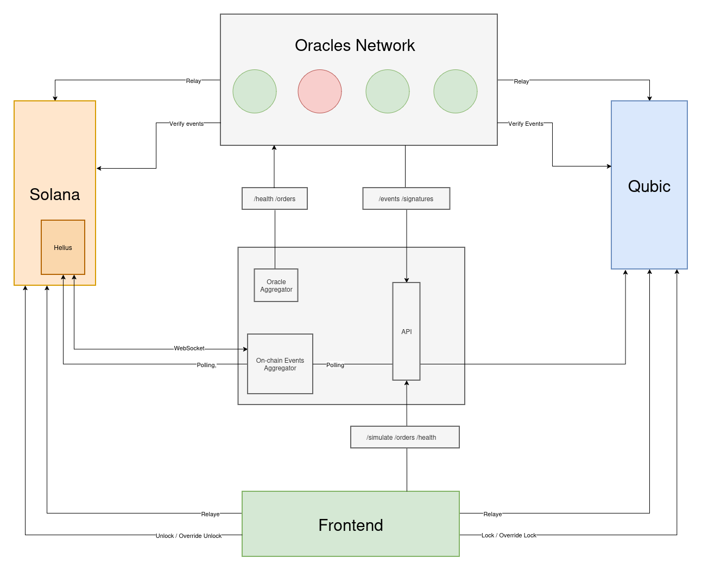
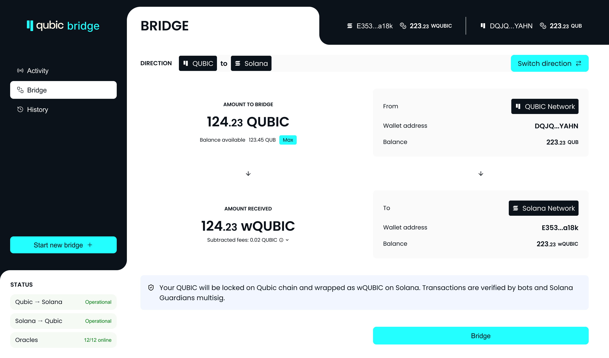
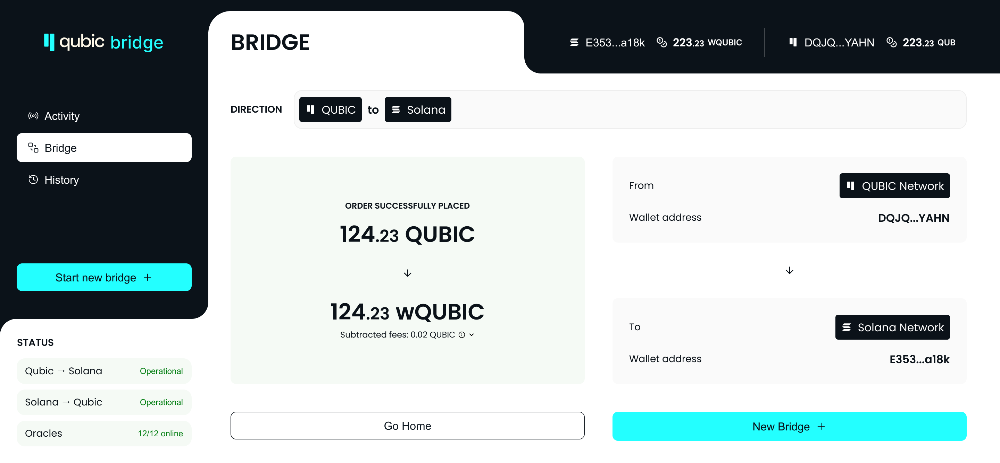
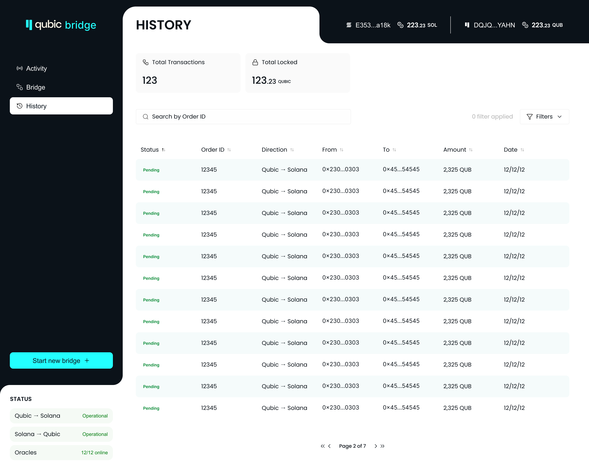

# Qubic ↔ Solana Bridge — Technical Overview (Milestone 3)

## Source Repositories

| Service | Repository |
|---------|------------|
| Hub | https://github.com/avicenne-studio/qs-bridge-hub |
| Oracle | https://github.com/avicenne-studio/qs-bridge-oracle |
| Frontend | https://github.com/avicenne-studio/qs-bridge-frontend |

---

## Milestones Status

The **core bridge logic is fully developed**: event indexing, oracle consensus, signature aggregation, order reconciliation, relaying, and the frontend UI are all complete and operational.

The **Solana side is fully implemented and functional end-to-end**: the on-chain Solana program, the oracle network, the hub, and the frontend interact together on Solana devnet. All tests pass with 100% coverage and the CI pipeline is green.

The **Qubic side code is written and integrated** — event polling, transaction validation, signing, and on-chain relay are all implemented. What remains is a small set of testnet-specific configuration items (contract address, RPC endpoints, network constants) that will be finalised when the **Qubic devnet becomes available (Milestone 6)**. No architectural changes are required at that point.

---

## 1. Network Roles & Interactions

### High-Level architecture Diagram



### Hub (aggregator)
> Source: https://github.com/avicenne-studio/qs-bridge-hub

The Hub is the **only public-facing backend service**. It:
- Listens to Solana program logs via WebSocket (primary + fallback) and to Helius for backfill; also polls the Qubic node for Qubic-side events. ([`listener/`](https://github.com/avicenne-studio/qs-bridge-hub/blob/main/src/plugins/app/listener))
- Persists raw chain events in its SQLite `events` table. ([`events.repository.ts`](https://github.com/avicenne-studio/qs-bridge-hub/blob/main/src/plugins/app/events/events.repository.ts))
- Polls every oracle periodically (configurable interval + jitter) for health status and for the oracle's local order list. ([`oracle-service.ts`](https://github.com/avicenne-studio/qs-bridge-hub/blob/main/src/plugins/app/oracle-service.ts))
- Reconciles oracle responses: all oracles reporting the same order must agree on the payload; majority-vote determines the canonical status. ([`oracle-orders-reconciliation.ts`](https://github.com/avicenne-studio/qs-bridge-hub/blob/main/src/plugins/app/indexer/oracle-orders-reconciliation.ts))
- Aggregates oracle signatures and marks orders `ready-for-relay` once the configurable threshold (`ORACLE_SIGNATURE_THRESHOLD`) is met.
- Exposes a public REST API consumed by the frontend and by third-party tooling. ([`routes/api/`](https://github.com/avicenne-studio/qs-bridge-hub/blob/main/src/routes/api))

### Oracle network
> Source: https://github.com/avicenne-studio/qs-bridge-oracle

Each oracle is an **independent, replicated validator node**. It:
- Accepts only requests signed by the Hub (`X-Hub-*` headers — see authentication below). ([`hub-verifier.ts`](https://github.com/avicenne-studio/qs-bridge-oracle/blob/main/src/plugins/app/hub/hub-verifier.ts))
- Polls the Hub for new chain events (cursor-based, incremental). ([`events.service.ts`](https://github.com/avicenne-studio/qs-bridge-oracle/blob/main/src/plugins/app/events/events.service.ts))
- Validates each event received from the Hub requesting chain-specific RPC (Solana or Qubic) and maps it into a local bridge order. ([`events-processor.ts`](https://github.com/avicenne-studio/qs-bridge-oracle/blob/main/src/plugins/app/events/events-processor.ts))
- Signs valid orders with its Solana / Qubic private keys. ([`signer.service.ts`](https://github.com/avicenne-studio/qs-bridge-oracle/blob/main/src/plugins/app/signer/signer.service.ts))
- Polls the Hub for the aggregated signature set; once the threshold is reached locally, marks its copy of the order `ready-for-relay`. ([`hub-signatures.service.ts`](https://github.com/avicenne-studio/qs-bridge-oracle/blob/main/src/plugins/app/hub/hub-signatures.service.ts))
- Relays the on-chain transaction (Solana or Qubic) with exponential backoff and capped retry attempts. ([`relayer.ts`](https://github.com/avicenne-studio/qs-bridge-oracle/blob/main/src/plugins/app/relayer/relayer.ts))
- Reports its order list and health status to the Hub on demand. ([`routes/api/`](https://github.com/avicenne-studio/qs-bridge-oracle/blob/main/src/routes/api))

### Solana program
The on-chain Solana program (Rust) handles `outbound` (Solana → Qubic) and `inbound` (Qubic → Solana) transfers, oracle management, and pause/unpause controls. Auto-generated TypeScript clients under `src/clients/js/` (Codama/Shank) are used by both Hub and Oracle — **do not hand-edit**. ([Hub client](https://github.com/avicenne-studio/qs-bridge-hub/blob/main/src/clients/js) · [Oracle client](https://github.com/avicenne-studio/qs-bridge-oracle/blob/main/src/clients/js))

### Helius
Helius is used as a **resilient transaction poller** on the Hub side. It supplements the WebSocket listener for backfill scenarios (reconnects, missed events) and provides a reliable HTTP-based alternative when WS is unavailable. ([`helius-transaction-poller.ts`](https://github.com/avicenne-studio/qs-bridge-hub/blob/main/src/plugins/app/listener/solana/helius-transaction-poller.ts))

---

## 2. Frontend

> Source: https://github.com/avicenne-studio/qs-bridge-frontend

React 19 + TypeScript + Vite application. The frontend is the entry point for end users — it connects directly to the Hub REST API and submits transactions to the Solana and Qubic chains via the user's wallets.

### Pages & Domains

Three pages, each a self-contained domain under `src/domains/`:

**Bridge** ([`bridge.page.tsx`](https://github.com/avicenne-studio/qs-bridge-frontend/blob/main/src/domains/bridge/react/bridge.page.tsx))
- Entry form for initiating a transfer (Solana → Qubic or Qubic → Solana).
- Calls `POST /api/orders/estimate` (500 ms debounce) to show live fee breakdown before the user confirms.
- On submit, builds and sends the on-chain transaction (Solana SPL instruction or Qubic lock payload).
- Switches to a success view that polls `GET /api/orders/trx-hash/:hash` every 3 s until the order is indexed, then every 10 s until finalized.
- Blocked and shows a warning when `GET /api/health/bridge` returns `paused: true`.




**Activity** ([`activity.page.tsx`](https://github.com/avicenne-studio/qs-bridge-frontend/blob/main/src/domains/activity/react/activity.page.tsx))
- Global paginated feed of all bridge orders (not filtered by wallet).
- Displays stats (total orders, total locked), a TanStack React Table, and pagination.
- Fetches `GET /api/orders` ordered descending (page size 5). ([`use-activity-orders.ts`](https://github.com/avicenne-studio/qs-bridge-frontend/blob/main/src/domains/activity/react/hooks/use-activity-orders.ts))

**History** ([`history.page.tsx`](https://github.com/avicenne-studio/qs-bridge-frontend/blob/main/src/domains/history/react/history.page.tsx))
- Per-wallet order history, filtered by the connected Solana and/or Qubic addresses.
- Rich filter panel: status, direction, source, destination, date range. ([`use-history-filters.ts`](https://github.com/avicenne-studio/qs-bridge-frontend/blob/main/src/domains/history/react/hooks/use-history-filters.ts))
- Fetches `GET /api/orders?participant[]=<solana_hex>&participant[]=<qubic_hex>` with active filters applied. ([`use-history-orders.ts`](https://github.com/avicenne-studio/qs-bridge-frontend/blob/main/src/domains/history/react/hooks/use-history-orders.ts))



### Hub API Client

> [`lib/hub/hub-client.ts`](https://github.com/avicenne-studio/qs-bridge-frontend/blob/main/src/lib/hub/hub-client.ts)

Base URL: `VITE_HUB_API_URL` env variable. Uses native `fetch()` with `AbortSignal`. Throws a typed `HubApiError(status, body)` on non-2xx responses.

| Hook | Endpoint | Interval |
|------|----------|----------|
| [`useFeeEstimate`](https://github.com/avicenne-studio/qs-bridge-frontend/blob/main/src/hooks/useFeeEstimate.ts) | `POST /api/orders/estimate` | On input change (500 ms debounce) |
| [`useOrderTracking`](https://github.com/avicenne-studio/qs-bridge-frontend/blob/main/src/hooks/useOrderTracking.ts) | `GET /api/orders/trx-hash/:hash` | 3 s until found, 10 s until finalized |
| [`useBridgeHealth`](https://github.com/avicenne-studio/qs-bridge-frontend/blob/main/src/hooks/useBridgeHealth.ts) | `GET /api/health/bridge` | 30 s |
| [`useBridgeHealth`](https://github.com/avicenne-studio/qs-bridge-frontend/blob/main/src/hooks/useBridgeHealth.ts) | `GET /api/health/oracles` | 60 s |
| [`use-activity-orders`](https://github.com/avicenne-studio/qs-bridge-frontend/blob/main/src/domains/activity/react/hooks/use-activity-orders.ts) | `GET /api/orders` | On page change |
| [`use-history-orders`](https://github.com/avicenne-studio/qs-bridge-frontend/blob/main/src/domains/history/react/hooks/use-history-orders.ts) | `GET /api/orders` | On page/filter change |

### Wallet Integration

**Solana** — via [Reown AppKit](https://reown.com/appkit) (formerly WalletConnect AppKit). ([`SolanaWalletProvider.tsx`](https://github.com/avicenne-studio/qs-bridge-frontend/blob/main/src/providers/SolanaWalletProvider.tsx))
- Supports all standard Solana wallets (Phantom, Backpack, etc.) via the AppKit modal.
- Token balance polled every 30 s from `getParsedTokenAccountsByOwner()`.
- Transaction signing and sending via `useSolanaProvider()`. ([`send.ts`](https://github.com/avicenne-studio/qs-bridge-frontend/blob/main/src/lib/bridge/solana/send.ts))

**Qubic** — via WalletConnect Sign protocol + local fallbacks. ([`QubicWalletProvider.tsx`](https://github.com/avicenne-studio/qs-bridge-frontend/blob/main/src/providers/QubicWalletProvider.tsx))
Four connection methods, each in its own modal tab:
- **WalletConnect** — remote signing via WC pairing URI. ([`connectWalletConnect.ts`](https://github.com/avicenne-studio/qs-bridge-frontend/blob/main/src/lib/qubic/connectWalletConnect.ts))
- **Seed phrase** — local import, signs locally in browser. ([`connectSeed.ts`](https://github.com/avicenne-studio/qs-bridge-frontend/blob/main/src/lib/qubic/connectSeed.ts))
- **MetaMask Snap** — if available. ([`connectMetaMask.ts`](https://github.com/avicenne-studio/qs-bridge-frontend/blob/main/src/lib/qubic/connectMetaMask.ts))
- **Vault file** — password-protected key file upload. ([`connectVault.ts`](https://github.com/avicenne-studio/qs-bridge-frontend/blob/main/src/lib/qubic/connectVault.ts))

Session is persisted in `sessionStorage` and restored on page load.

## 3. Hub ↔ Oracle Authentication

All inter-service communication from Hub to Oracle is cryptographically authenticated to prevent malicious/spam requests.

### Signing (Hub side)
> [`hub-signer.ts`](https://github.com/avicenne-studio/qs-bridge-hub/blob/main/src/plugins/infra/hub-signer.ts)

For every outgoing request to an oracle, the Hub:
1. Computes a **canonical string**:
   ```
   METHOD
   URL
   hubId=<hubId>
   timestamp=<unix-seconds>
   nonce=<random-base64>
   bodyhash=<sha256-hex-of-body>
   ```
2. Signs the canonical string with its **Ed25519/RSA private key** (PEM, from `HUB_KEYS_FILE`). ([`hub-keys.ts`](https://github.com/avicenne-studio/qs-bridge-hub/blob/main/src/plugins/infra/hub-keys.ts))
3. Attaches the following HTTP headers to the request:

   | Header | Content |
   |--------|---------|
   | `X-Hub-Id` | Hub identifier |
   | `X-Key-Id` | Key slot identifier (enables rotation) |
   | `X-Timestamp` | Unix seconds |
   | `X-Nonce` | Random base64, single-use |
   | `X-Body-Hash` | SHA-256 hex of the request body |
   | `X-Signature` | Base64-encoded signature over the canonical string |

### Verification (Oracle side)
> [`hub-verifier.ts`](https://github.com/avicenne-studio/qs-bridge-oracle/blob/main/src/plugins/app/hub/hub-verifier.ts)

The oracle's `preValidation` Fastify hook rejects any `/api/*` request that fails any of these checks (in order):

1. **Header schema** — all six `X-Hub-*` headers must be present and well-formed.
2. **Timestamp skew** — `|now − X-Timestamp| ≤ 60 s`.
3. **Nonce replay** — the `(hubId, kid, nonce)` triple must not already exist in the `hub_nonces` SQLite table. ([`hub-nonces.repository.ts`](https://github.com/avicenne-studio/qs-bridge-oracle/blob/main/src/plugins/app/hub/hub-nonces.repository.ts))
4. **Body hash** — `X-Body-Hash` must match the SHA-256 of the actual request body.
5. **Signature** — `X-Signature` must be a valid signature over the canonical string under the public key identified by `(hubId, kid)` in `HUB_KEYS_FILE`.

A used nonce is immediately persisted. Nonces are periodically evicted by [`hub-nonces-cleaner.ts`](https://github.com/avicenne-studio/qs-bridge-oracle/blob/main/src/plugins/app/hub/hub-nonces-cleaner.ts).

**Key rotation**: `HUB_KEYS_FILE` contains `current` and `next` key slots. The oracle accepts requests signed by either key, allowing seamless rotation without downtime.

---

## 4. Orders Reconciliation & Signature Aggregation

### Reconciliation (Hub)
> [`oracle-orders-reconciliation.ts`](https://github.com/avicenne-studio/qs-bridge-hub/blob/main/src/plugins/app/indexer/oracle-orders-reconciliation.ts)

When the Hub polls multiple oracles, it can receive conflicting order views. The reconciliation logic:
- For each order ID, **all oracle payloads must be byte-identical** (amount, addresses, chain metadata). Any oracle reporting a divergent payload is flagged as inconsistent.
- The canonical **status** is determined by majority vote across oracle responses.
- Only orders that pass reconciliation are persisted or updated in the Hub's SQLite `orders` table. ([`orders.repository.ts`](https://github.com/avicenne-studio/qs-bridge-hub/blob/main/src/plugins/app/indexer/orders.repository.ts))

### Signature threshold (`computeRequiredSignatures`)
> [`oracle-service.ts`](https://github.com/avicenne-studio/qs-bridge-hub/blob/main/src/plugins/app/oracle-service.ts)

`ORACLE_SIGNATURE_THRESHOLD` is interpreted as:
- A **fraction** (e.g. `0.6`) of `ORACLE_COUNT` when in [0, 1] → ceiling of `threshold × count` signatures required.
- An **absolute integer** (e.g. `4`) otherwise.

`GET /api/orders/signatures` returns only orders whose aggregated signature count meets this threshold — these are the orders safe to relay on-chain.

---

## 5. Hub Public API

> Source: [`routes/api/`](https://github.com/avicenne-studio/qs-bridge-hub/blob/main/src/routes/api)

The Hub exposes a versioned REST API at `/api`. Full interactive documentation is available at `/docs` (Swagger UI / OpenAPI 3).

All responses are JSON. TypeBox schemas enforce strict request and response validation.

### Endpoints

#### Orders
> [`orders/index.ts`](https://github.com/avicenne-studio/qs-bridge-hub/blob/main/src/routes/api/orders/index.ts)

**`GET /api/orders`** — Paginated order listing.

Query params:

| Param | Type | Description |
|-------|------|-------------|
| `page` | integer ≥ 1 | Page number (default 1) |
| `limit` | integer 1–100 | Results per page (default 10) |
| `order` | `asc` \| `desc` | Sort by `created_at` (default `desc`) |
| `source` | `qubic` \| `solana` | Filter by source chain |
| `dest` | `qubic` \| `solana` | Filter by destination chain |
| `status[]` | array of status strings | Filter by one or more statuses |
| `from` | string | Sender address filter |
| `to` | string | Recipient address filter |
| `amount_min` | integer string | Lower amount bound |
| `amount_max` | integer string | Upper amount bound |
| `created_after` | ISO-8601 | Lower `created_at` bound |
| `created_before` | ISO-8601 | Upper `created_at` bound |
| `id` | string | Exact order ID |
| `participant[]` | string array (max 2) | Match orders where `from` or `to` is in this list |

Response:
```json
{
  "data": [ { "id": "...", "source": "solana", "dest": "qubic", "status": "finalized", ... } ],
  "pagination": { "page": 1, "limit": 10, "total": 42 }
}
```

**`GET /api/orders/signatures`** — Orders ready for relay, with their oracle signatures.

Response:
```json
{
  "data": [
    { "orderId": "...", "signatures": ["<base64>", "<base64>", ...] }
  ]
}
```

**`GET /api/orders/events`** — Cursor-based pagination over raw Solana/Qubic bridge events (used by oracles internally and available for indexing).

Query params: `created_after` (ISO-8601, required for first page), `after_id` (integer cursor, default 0), `limit` (1–100, default 50).

Response includes a `cursor` object (`{ createdAt, id }`) to pass as `created_after` + `after_id` on the next call.

**`GET /api/orders/trx-hash/:hash`** — Fetch a single order by its origin transaction hash. Returns the order plus all collected oracle signatures.

**`POST /api/orders/estimate`** — Estimate bridge fees before submitting a transfer. ([`fee-estimation/`](https://github.com/avicenne-studio/qs-bridge-hub/blob/main/src/plugins/app/fee-estimation))

Body:
```json
{ "amount": "1000000", "destination": "solana" }
```
Response:
```json
{ "data": { "solanaFee": "5000", "qubicFee": "10000" } }
```

#### Health
> [`health/index.ts`](https://github.com/avicenne-studio/qs-bridge-hub/blob/main/src/routes/api/health/index.ts)

**`GET /api/health/bridge`** — Bridge pause status.
```json
{ "paused": false }
```

**`GET /api/health/oracles`** — Per-oracle liveness and relayer fee snapshot.
```json
{
  "oracles": [
    { "url": "https://oracle1.example.com", "status": "ok", "timestamp": "...", "relayerFeeSolana": "5000", "relayerFeeQubic": "10000" }
  ]
}
```

#### Keys
> [`keys/index.ts`](https://github.com/avicenne-studio/qs-bridge-hub/blob/main/src/routes/api/keys/index.ts)

**`GET /api/keys`** — Hub public keys for verification tooling.
```json
{
  "hubId": "hub-1",
  "current": { "kid": "key-1", "publicKeyPem": "-----BEGIN PUBLIC KEY-----...", "fingerprint": "..." },
  "next": { "kid": "key-2", "publicKeyPem": "...", "fingerprint": "..." }
}
```

### SDK / third-party integration
The Hub API is a plain HTTP REST API — no SDK is required. Any HTTP client can consume it. The OpenAPI spec at `/docs` can be used to generate typed clients in any language.

---

## 6. Code Quality & CI

### 100% test coverage
Both the Hub and Oracle enforce **100% line, branch, function, and statement coverage** via `c8`. The coverage gate is checked on every test run (`npm test`). Tests are written with the Node.js built-in `--test` runner, executed via `tsx`, and use in-memory SQLite so no external dependencies are required.

- Hub tests: [`test/`](https://github.com/avicenne-studio/qs-bridge-hub/blob/main/test)
- Oracle tests: [`test/`](https://github.com/avicenne-studio/qs-bridge-oracle/blob/main/test)

The frontend uses Vitest + Testing Library. ([`src/**/*.test.ts`](https://github.com/avicenne-studio/qs-bridge-frontend/blob/main/src))

### Continuous Integration
The CI pipeline runs on GitHub Actions and is **publicly visible**:

- Hub CI: https://github.com/avicenne-studio/qs-bridge-hub/actions
- Oracle CI: https://github.com/avicenne-studio/qs-bridge-oracle/actions
- Frontend CI: https://github.com/avicenne-studio/qs-bridge-frontend/actions

On every push and pull request it:
- Installs dependencies (including native SQLite rebuild).
- Runs the full test suite with coverage for Hub and Oracle.
- Runs TypeScript type-checking and linting for all services.
- Fails the build if any coverage threshold is not met.

This gives external contributors and auditors a transparent, always-up-to-date view of the project's test health.
